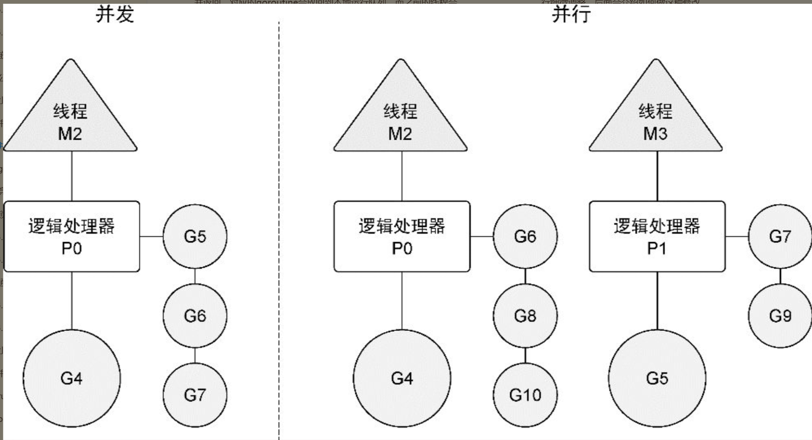

.. contents::
   :depth: 3
..

并发与并行
==========

1.并发（Concurrent）
--------------------

多进程指令被CPU快速轮换执行。宏观上，多个进程同时执行。微观上，\ **多个进程非同时执行，时间分成若干段，多个进程快速交替执行，在一个处理器**\ 。

操作系统进程的并发：CPU划分时间片段（时间区间），进程在时间区间之间来回切换处理。CPU处理速度快，时间间隔处理得当，用户感觉是多个进程同时进行。

2.并行（Parallel）
------------------

同一时刻多条指令在\ **多个处理器**\ 上同时执行。

3. 串行、并发与并行
-------------------

串行：我们都是先读小学，小学毕业后再读初中，读完初中再读高中。

并发：同一时间段内执行多个任务（你在用微信和两个女朋友聊天）。

并行：同一时刻执行多个任务（你和你朋友都在用微信和女朋友聊天）

4.区别
------

-  并发偏重于多个任务交替执行，而多个任务间可能是串行的。并发是逻辑上的同时发生（simultaneous）。串行通讯，传输1bit信号。
-  并行偏重于同时执行。是物理上的同时发生。并行通讯，传输多bit信号。

并发（concurrency）不是并行（parallelism）。

并行是让不同的代码片段同时在不同的物理处理器上执行。并行的关键是同时做很多事情，而并发是指同时管理很多事情，这些事情可能只做了一半就被暂停去做别的事情了。

在很多情况下，并发的效果比并行好，因为操作系统和硬件的总资源一般很少，但能支持系统同时做很多事情。

这种“使用较少的资源做更多的事情”的哲学，也是指导Go语言设计的哲学。

**并发和并行的区别**

